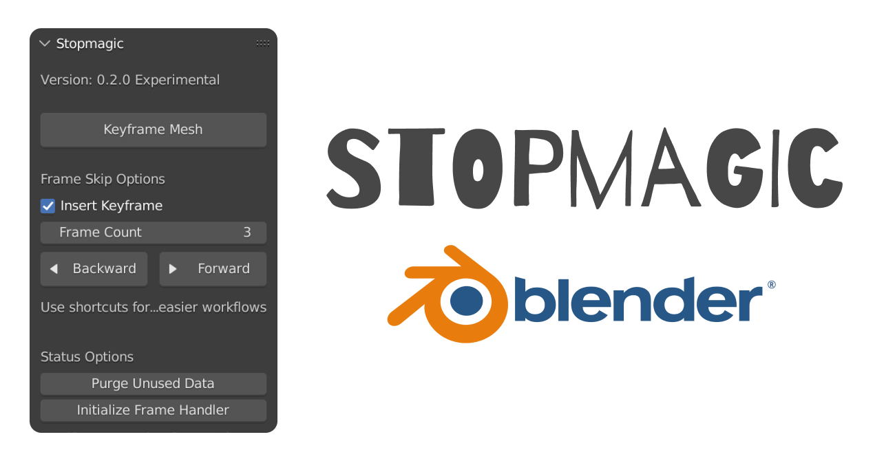

Stopmagic gives you the power of creating amazing Stop Motion animations faster and easier than ever before. This project is maintained by Aldrin Mathew.

This is a revival of the Keymesh addon developed by Pablo Dobarro, and the Animation Testing for Keymesh was done by Daniel Martinez Lara.

## Features

### Frame Skipping
Artists can now seamlessly skip frames forwards or backwards and add a keyframe to do stop motion poses easily. You can change the number of frames to be skipped and also disable adding keyframe automatically, if required.

### Shortcuts for faster workflows
- `Ctrl Shift A` adds a Keyframe to the current active mesh and frame.
- `Ctrl Shift Z` skips frames backward, and adds keyframe if chosen
- `Ctrl Shift X` skips frames forward, and adds keyframe if chosen

All of these shortcuts can be customized if required.

### Initializing Frame Handler
Whenever the addon stops working, use this button to initialize the frame handler.

### Purge Unused Data
Unused mesh data can be purged to save space and remove clutter

## Documentation

Visit: [**Keymesh Launch Video**](https://vimeo.com/506765863) to see a demonstration and tutorial by *Daniel Martinez Lara*.