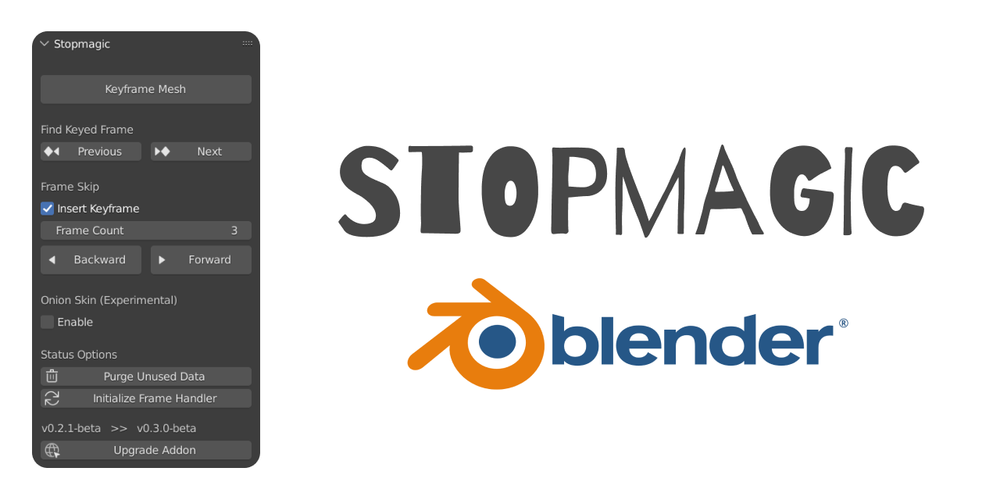

Stopmagic gives you the power of creating amazing Stop Motion animations faster and easier than ever before. This project is maintained by Aldrin Mathew.

This is a revival of the Keymesh addon developed by Pablo Dobarro, and the Animation Testing for Keymesh was done by Daniel Martinez Lara.

## Features

### Shortcuts for faster workflows

- `Ctrl Shift A` adds a Keyframe to the current active mesh and frame.
- `Ctrl Shift Z` skips frames backward, and adds keyframe if chosen
- `Ctrl Shift X` skips frames forward, and adds keyframe if chosen
- `Ctrl Shift C` finds the previous frame with a keyed mesh, if any
- `Ctrl Shift V` finds the next frame with a keyed mesh, if any

All of these shortcuts can be customized if required.

### Frame Skipping

Artists can now seamlessly skip frames forwards or backwards and add a keyframe to do stop motion poses easily. You can change the number of frames to be skipped and also disable adding keyframe automatically, if required.

### Onion Skins (Experimental)

You can now provide a frame range and see the past and future onion skins of the active object. Keep in mind that this feature is experimental and also creates new objects and meshes in your scene. This could also be buggy. You can also change the color of the past and future objects of the onion skin

### Finding Keyed Frame

This feature allows you to jump to the next or previous frame that has a keyed mesh in it. This is very useful when you want to work faster and doesn't want to navigate through the timeline a lot

### Upgrade Addon

If network is available, this checks whether a new version of the addon is available. If so, it will show a button that directly navigates the user to the download link for the latest version. If there is no network, this button will navigate the user to the releases page of the addon

### Initializing Frame Handler

Whenever the addon stops working, use this button to initialize the frame handler.

### Purge Unused Data

Unused mesh data can be purged to save space and remove clutter

## Documentation

The documentation of the addon is available [here](https://github.com/aldrinsartfactory/stopmagic/wiki)
